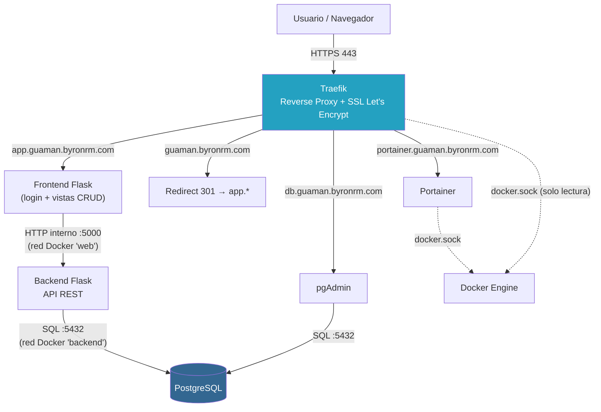
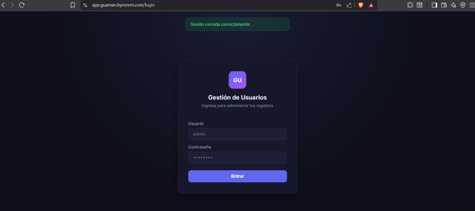
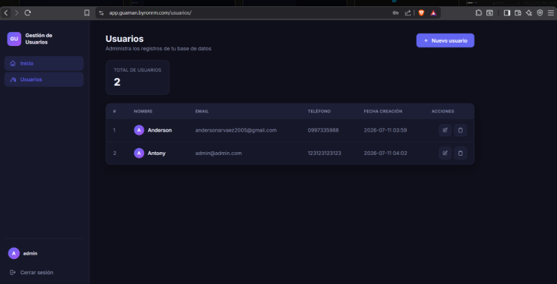
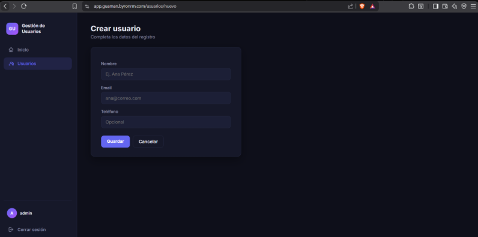
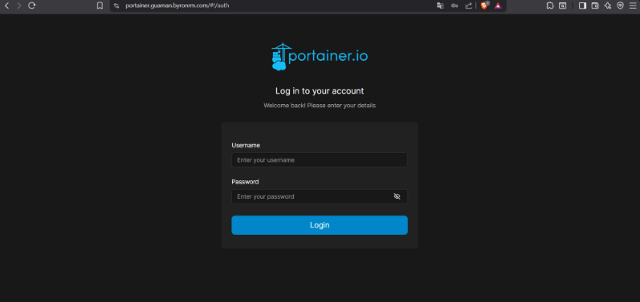
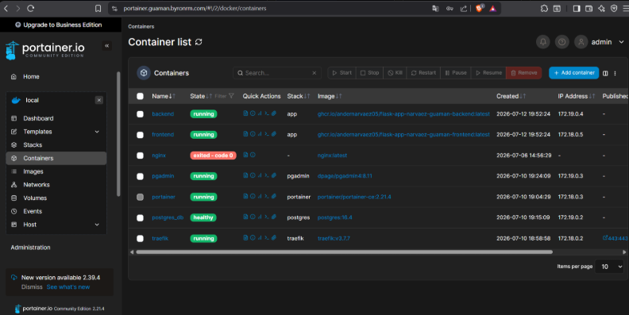
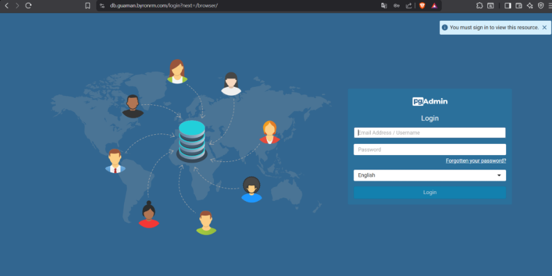
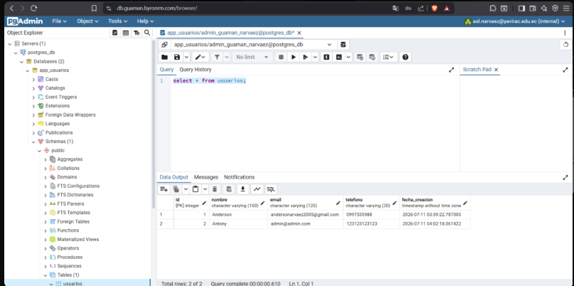

# Gestión de Usuarios — Despliegue en VPS con Docker + Traefik

Proyecto final: aplicación web full-stack (Flask + PostgreSQL) desplegada en un VPS mediante contenedores Docker, publicada por subdominios a través de Traefik como reverse proxy con SSL automático (Let's Encrypt), y con un pipeline de CI/CD vía GitHub Actions que construye y despliega automáticamente en cada `push` a `main`.

## 1. Entregables

### 1.1 URL del repositorio GitHub

https://github.com/Andernarvaez05/flask-app-narvaez-guaman

### 1.2 Documentación de despliegue

Este mismo archivo (`README.md`) constituye la documentación de despliegue. Las acciones están organizadas en el orden en que se ejecutaron:

1. Preparar el VPS y habilitar Docker.
2. Crear las redes Docker (`web`, `backend`).
3. Levantar Traefik.
4. Levantar Portainer.
5. Levantar PostgreSQL.
6. Levantar pgAdmin.
7. Desplegar backend y frontend (vía CI/CD).
8. Configurar la redirección del dominio raíz.
9. Validar los servicios y recopilar evidencia.

Ver la sección [Despliegue paso a paso](#despliegue-paso-a-paso) para el detalle completo de cada acción, con sus archivos de configuración reales.

### 1.3 URLs de los servicios publicados

| Servicio | URL | Descripción |
|---|---|---|
| Aplicación (frontend) | https://app.guaman.byronrm.com | CRUD de usuarios, con login |
| Dominio raíz | https://guaman.byronrm.com | Redirige automáticamente a `app.*` |
| Portainer | https://portainer.guaman.byronrm.com | Panel de administración de Docker |
| pgAdmin | https://db.guaman.byronrm.com | Administrador gráfico de PostgreSQL |

El **backend** (API REST Flask) no tiene subdominio propio: vive solo dentro de la red interna de Docker (`web`) y el frontend lo consume por hostname interno (`http://backend:5000`), nunca expuesto directamente a internet.

### 1.4 Diagrama de arquitectura

Ver sección [Arquitectura](#arquitectura) más abajo (diagrama Mermaid, renderizado nativamente por GitHub).

### 1.5 Evidencia de funcionamiento

Ver sección [Evidencia de funcionamiento](#evidencia-de-funcionamiento) y la [Matriz de comprobación final](#matriz-de-comprobación-final), al final de este documento.

## Arquitectura



**Redes Docker:**
- `web` (externa): Traefik, frontend, backend, Portainer, pgAdmin.
- `backend` (externa): backend, PostgreSQL, pgAdmin (para que puedan hablarse por nombre de servicio sin exponer la base de datos a `web`).

**Principio de seguridad aplicado:** solo Traefik publica puertos directamente al host (80/443). Todo lo demás —incluida la base de datos y el backend— es accesible únicamente a través de la red interna de Docker.

## Componentes

- **Traefik** — reverse proxy dinámico. Descubre contenedores vía `docker.sock` (montado en solo lectura) leyendo sus `labels`, enruta por `Host()` y gestiona certificados SSL automáticos vía el protocolo ACME (challenge HTTP-01).
- **Portainer** — panel visual de administración del Docker Engine del VPS.
- **Frontend** — Flask + Jinja2 + Flask-Login. Renderiza las vistas del CRUD server-side y llama al backend internamente vía `requests`. Autenticación con un único usuario administrador (credenciales por variable de entorno, contraseña almacenada como hash `scrypt`).
- **Backend** — API REST Flask + SQLAlchemy, expone `/api/usuarios` (GET, POST, PUT, DELETE) y `/api/health`. Corre con Gunicorn en modo `--preload` para evitar condiciones de carrera al crear las tablas.
- **PostgreSQL** — base de datos relacional, con volumen persistente y `restart: always`.
- **pgAdmin** — administrador gráfico de PostgreSQL, publicado por su propio subdominio.

## Estructura del repositorio

```
.
├── backend/                 # API REST Flask + SQLAlchemy
│   ├── app/
│   │   ├── models/usuario.py
│   │   └── __init__.py      # Application factory + endpoints
│   ├── Dockerfile
│   └── requirements.txt
├── frontend/                 # Flask + Jinja2 + Flask-Login
│   ├── app/
│   │   ├── controllers/      # auth_controller.py, usuarios_controller.py
│   │   ├── views/            # base.html, auth/, usuarios/
│   │   └── static/style.css
│   ├── Dockerfile
│   └── requirements.txt
├── docker-compose.yml        # Stack de la app (backend + frontend), desplegado por CI/CD
├── .env.example               # Plantilla de variables de entorno (sin valores reales)
├── .github/workflows/deploy.yml   # Pipeline CI/CD
└── docs/evidencia/            # Capturas de funcionamiento
```

## Variables de entorno

El `.env` real vive únicamente en el VPS (`~/proyecto-devops/app/.env`) y nunca se sube al repositorio. Plantilla en [`.env.example`](./.env.example):

| Variable | Uso |
|---|---|
| `POSTGRES_USER`, `POSTGRES_PASSWORD`, `POSTGRES_HOST`, `POSTGRES_PORT`, `POSTGRES_DB` | Conexión del backend a PostgreSQL |
| `SECRET_KEY` | Clave de sesión de Flask |
| `BACKEND_URL` | URL interna del backend, consumida por el frontend |
| `ADMIN_USERNAME` | Usuario administrador de la app |
| `ADMIN_PASSWORD_HASH` | Hash `scrypt` de la contraseña (generado con `werkzeug.security.generate_password_hash`) |

> **Nota técnica:** como Docker Compose interpola variables `$VAR` dentro de cualquier `.env` que comparta carpeta con `docker-compose.yml`, cada `$` literal dentro del hash debe escaparse como `$$` (ej. `scrypt:32768:8:1$$salt$$hash`), o Compose lo sustituye silenciosamente por una cadena vacía.

## CI/CD — GitHub Actions

Cada `push` a `main` dispara [`.github/workflows/deploy.yml`](./.github/workflows/deploy.yml):

1. **`build-and-push`** (matriz: `backend`, `frontend`) — construye ambas imágenes Docker y las publica en GitHub Container Registry (`ghcr.io`).
2. **`deploy`** — copia el `docker-compose.yml` actualizado al VPS por SCP, y por SSH ejecuta `docker compose pull && docker compose up -d`, dejando el stack corriendo con las imágenes recién construidas.

Secrets usados: `VPS_HOST`, `VPS_USER`, `VPS_SSH_KEY` (clave SSH dedicada, de solo despliegue). El `.env` con credenciales reales nunca pasa por GitHub: se crea una sola vez, manualmente, en el VPS.

## Despliegue paso a paso

### 1. Preparación del VPS

Se verificó el sistema operativo y se actualizaron paquetes. El paso crítico fue habilitar el arranque automático de Docker con `systemd`, para que sobreviva a un reinicio del servidor sin intervención manual:

```bash
sudo systemctl enable docker.service
sudo systemctl enable containerd.service
sudo systemctl enable docker.socket
sudo systemctl is-enabled docker   # debe responder: enabled
```

Se creó la estructura de carpetas del proyecto y las **redes Docker externas** compartidas entre todos los stacks (necesarias porque Traefik, Portainer, la app y la base de datos viven en archivos `docker-compose.yml` distintos, y solo pueden verse entre sí por nombre de servicio si comparten red):

```bash
mkdir -p ~/proyecto-devops/{traefik,portainer,postgres,pgadmin,app}
docker network create web       # red "pública": Traefik + todo lo enrutable por subdominio
docker network create backend   # red interna: solo backend, Postgres y pgAdmin
```

### 2. Traefik — reverse proxy y SSL automático

Traefik lee el socket de Docker (montado en modo solo lectura) y descubre automáticamente los contenedores con la label `traefik.enable=true`, sin necesitar archivos de configuración estáticos por cada servicio nuevo.

`traefik.yml` (configuración estática):
```yaml
api:
  dashboard: true
entryPoints:
  web:
    address: ":80"
    http:
      redirections:
        entryPoint:
          to: websecure
          scheme: https
  websecure:
    address: ":443"
providers:
  docker:
    exposedByDefault: false   # ningún contenedor se publica sin la label explícita
    network: web
certificatesResolvers:
  letsencrypt:
    acme:
      email: tu_correo@ejemplo.com
      storage: /letsencrypt/acme.json
      httpChallenge:
        entryPoint: web
```

El archivo `acme.json` (donde se guardan certificados y llaves privadas) requiere permisos `600`, o Traefik se niega a arrancar:
```bash
touch acme.json && chmod 600 acme.json
```

`docker-compose.yml` de Traefik:
```yaml
services:
  traefik:
    image: traefik:v3.7.7
    container_name: traefik
    restart: always
    security_opt:
      - no-new-privileges:true
    environment:
      - DOCKER_API_VERSION=1.55
    ports:
      - "80:80"
      - "443:443"
    volumes:
      - /var/run/docker.sock:/var/run/docker.sock:ro
      - ./traefik.yml:/traefik.yml:ro
      - ./acme.json:/letsencrypt/acme.json
    networks:
      - web
networks:
  web:
    external: true
```

**Cómo emite el certificado SSL:** Traefik detecta por las labels que un dominio necesita HTTPS, contacta a Let's Encrypt, y este exige probar control del dominio (challenge HTTP-01): pide que Traefik sirva un token especial bajo `http://dominio/.well-known/acme-challenge/<token>`. Let's Encrypt verifica esa URL desde sus propios servidores en internet — por eso el DNS debe apuntar al VPS y el puerto 80 debe estar abierto *antes* de pedir el certificado. Una vez emitido, Traefik lo renueva automáticamente antes de que expire (90 días).

### 3. Portainer

Panel gráfico de administración del Docker Engine, publicado por su propio subdominio:

```yaml
services:
  portainer:
    image: portainer/portainer-ce:2.21.4
    container_name: portainer
    restart: always
    volumes:
      - /var/run/docker.sock:/var/run/docker.sock
      - portainer_data:/data
    networks:
      - web
    labels:
      - "traefik.enable=true"
      - "traefik.http.routers.portainer.rule=Host(`portainer.guaman.byronrm.com`)"
      - "traefik.http.routers.portainer.entrypoints=websecure"
      - "traefik.http.routers.portainer.tls.certresolver=letsencrypt"
      - "traefik.http.services.portainer.loadbalancer.server.port=9000"
networks:
  web:
    external: true
volumes:
  portainer_data:
```

### 4. PostgreSQL

```yaml
services:
  db:
    image: postgres:16.4
    container_name: postgres_db
    restart: always
    env_file:
      - .env
    volumes:
      - postgres_data:/var/lib/postgresql/data
    networks:
      - backend
    healthcheck:
      test: ["CMD-SHELL", "pg_isready -U ${POSTGRES_USER} -d ${POSTGRES_DB}"]
networks:
  backend:
    external: true
volumes:
  postgres_data:
```

Sin labels de Traefik ni red `web`: nunca es alcanzable desde internet, solo desde contenedores en la red `backend`.

### 5. pgAdmin

Necesita estar en **dos** redes: `backend` (para hablar con Postgres) y `web` (para que Traefik lo pueda enrutar):

```yaml
services:
  pgadmin:
    image: dpage/pgadmin4:8.11
    container_name: pgadmin
    restart: always
    env_file:
      - .env
    networks:
      - web
      - backend
    labels:
      - "traefik.enable=true"
      - "traefik.http.routers.pgadmin.rule=Host(`db.guaman.byronrm.com`)"
      - "traefik.http.routers.pgadmin.entrypoints=websecure"
      - "traefik.http.routers.pgadmin.tls.certresolver=letsencrypt"
      - "traefik.http.services.pgadmin.loadbalancer.server.port=80"
```

### 6. Backend — API REST (Flask + SQLAlchemy)

Expone `/api/usuarios` (GET, POST, PUT, DELETE) y `/api/health` sobre el modelo `Usuario`. Corre con Gunicorn, 3 workers, y la flag `--preload`: carga la aplicación una sola vez en el proceso maestro antes de bifurcar los workers, evitando que los 3 ejecuten `db.create_all()` en paralelo al arrancar (ver bug #5 más abajo):

```dockerfile
CMD ["gunicorn", "--bind", "0.0.0.0:5000", "--workers", "3", "--preload", "run:app"]
```

### 7. Frontend — interfaz web (Flask + Jinja2 + Flask-Login)

No tiene acceso directo a la base de datos: renderiza HTML server-side y consume la API del backend con la librería `requests`, usando el hostname interno `http://backend:5000`. Autenticación con un único usuario administrador (sin tabla en base de datos), credenciales por variable de entorno y contraseña almacenada como hash `scrypt`:

```bash
python3 -c "from werkzeug.security import generate_password_hash; print(generate_password_hash('tu_password'))"
```

Rutas protegidas con el decorador `@login_required` de Flask-Login.

### 8. Stack de la app + redirección del dominio raíz

El dominio raíz (`guaman.byronrm.com`, sin subdominio) redirige automáticamente a `app.guaman.byronrm.com` mediante un middleware de Traefik (`redirectregex`) agregado como label extra en el contenedor `frontend`:

```yaml
labels:
  - "traefik.http.routers.frontend.rule=Host(`app.guaman.byronrm.com`)"
  - "traefik.http.routers.frontend.entrypoints=websecure"
  - "traefik.http.routers.frontend.tls.certresolver=letsencrypt"
  - "traefik.http.services.frontend.loadbalancer.server.port=5001"

  - "traefik.http.routers.frontend-root.rule=Host(`guaman.byronrm.com`)"
  - "traefik.http.routers.frontend-root.middlewares=redirect-to-app"
  - "traefik.http.middlewares.redirect-to-app.redirectregex.regex=^https?://guaman\\.byronrm\\.com/(.*)"
  - "traefik.http.middlewares.redirect-to-app.redirectregex.replacement=https://app.guaman.byronrm.com/$${1}"
  - "traefik.http.middlewares.redirect-to-app.redirectregex.permanent=true"
```

### 9. Conectar el repositorio a GitHub Actions

Una vez con el repo en GitHub, se generó una clave SSH dedicada solo para el despliegue (distinta a la personal), se agregó la pública a `~/.ssh/authorized_keys` del VPS, y la privada se guardó como GitHub Secret. Con `VPS_HOST`, `VPS_USER` y `VPS_SSH_KEY` configurados, cada `push` a `main` construye y despliega automáticamente frontend y backend (ver sección de CI/CD arriba).

## Errores encontrados durante el despliegue

| # | Síntoma | Causa | Solución |
|---|---|---|---|
| 1 | Traefik: `client version 1.24 is too old` | El cliente Docker embebido en Traefik negocia una API antigua por defecto; el daemon reciente la rechaza | `DOCKER_API_VERSION=1.55` como variable de entorno del contenedor Traefik |
| 2 | ACME: `NXDOMAIN` al emitir certificados | El DNS aún no había propagado en el primer intento | Verificado con `dig @8.8.8.8`, reintento forzado con `docker restart traefik` |
| 3 | Build falla: `repository name must be lowercase` | El usuario de GitHub tiene mayúsculas; Docker exige tags en minúsculas | Paso en el workflow que normaliza el nombre a minúsculas antes del build |
| 4 | Frontend: `TemplateNotFound: auth/login.html` | Flask busca plantillas en `templates/` por defecto; se guardaron en `views/` | `Flask(__name__, template_folder='views')` |
| 5 | Backend: `IntegrityError` en `usuarios_id_seq` | Los 3 workers de Gunicorn ejecutan `db.create_all()` en paralelo al arrancar | Flag `--preload` en Gunicorn |
| 6 | Login falla pese a hash correcto | Docker Compose interpola `$VAR` automáticamente en el `.env`, vaciando los `$` del hash scrypt | Escapar cada `$` como `$$` en el `.env` |

## Evidencia de funcionamiento

**Login de la aplicación**


**CRUD — listado de usuarios (datos persistidos en PostgreSQL)**


**CRUD — creación de usuario**


**Portainer — login**


**Portainer — los 7 contenedores del stack corriendo**


**pgAdmin — login**


**pgAdmin — consulta mostrando los registros reales en la tabla `usuarios`**


## Matriz de comprobación final

| # | Componente | Comando o prueba | Resultado esperado | Evidencia |
|---|---|---|---|---|
| 1 | Docker | `docker version` | Cliente y servidor responden | ✅ |
| 2 | Docker Compose | `docker compose version` | Versión v2 disponible | ✅ |
| 3 | Red `web` | `docker network inspect web` | Traefik, frontend, backend, Portainer, pgAdmin conectados | ✅ |
| 4 | Red `backend` | `docker network inspect backend` | Backend, PostgreSQL y pgAdmin conectados | ✅ |
| 5 | Traefik | `docker ps` + `docker logs traefik` | Contenedor activo, puertos 80/443 escuchando | ✅ |
| 6 | Portainer | Abrir `portainer.guaman.byronrm.com` | Login y dashboard disponibles, 7 contenedores visibles | ✅ ([captura](./docs/evidencia/05-portainer-containers.png)) |
| 7 | PostgreSQL | `docker inspect --format='{{json .State.Health}}' postgres_db` | Estado `healthy`, acepta conexiones internas | ✅ |
| 8 | pgAdmin | Abrir `db.guaman.byronrm.com` | Login y conexión al servidor `postgres_db` | ✅ ([captura](./docs/evidencia/07-pgadmin-datos.png)) |
| 9 | Backend (API) | `curl https://backend interno /api/health` (desde dentro de la red) | Respuesta HTTP 200 JSON `{"status":"ok"}` | ✅ |
| 10 | Frontend | Abrir `app.guaman.byronrm.com` | Login funcional, redirige si no hay sesión | ✅ ([captura](./docs/evidencia/01-login.png)) |
| 11 | Integración frontend↔backend↔BD | Crear un usuario desde el CRUD y verificarlo en pgAdmin | El registro creado en la UI aparece persistido en la tabla `usuarios` | ✅ ([captura](./docs/evidencia/03-usuarios-crear.png), [captura](./docs/evidencia/07-pgadmin-datos.png)) |
| 12 | HTTPS | Revisar candado del navegador en los 4 dominios | Certificados válidos emitidos por Let's Encrypt | ✅ |
| 13 | CI/CD | `git push` a `main` | GitHub Actions construye, publica en GHCR y redespliega automáticamente en el VPS | ✅ |
| 14 | Dominio raíz | Abrir `guaman.byronrm.com` | Redirige automáticamente a `app.guaman.byronrm.com` | ✅ |

## Autores

Proyecto desarrollado por Narváez y Guamán — Despliegue de Aplicaciones, 2026.
